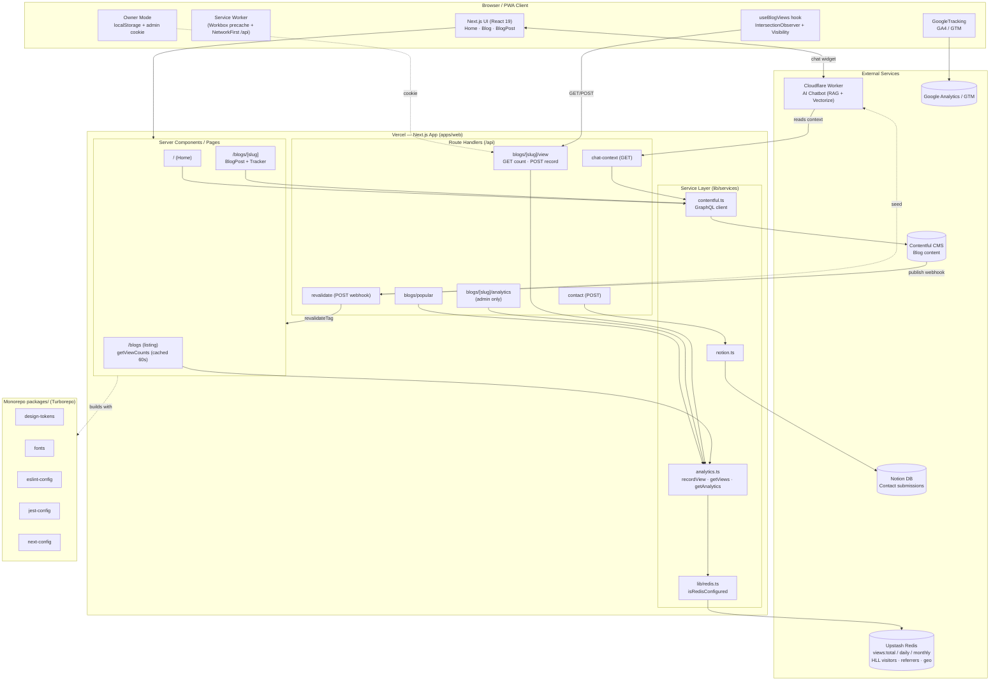

# Architecture: HLD → LLD

A complete walkthrough of the platform — from the 10,000-foot high-level design
(HLD) down to the low-level design (LLD) of every section: the monorepo
structure, the shared packages, the Next.js app layers, the API endpoints, and
the data model. For each part this document explains **what** it is, **why** it
was chosen, **why it's good**, and **where it is over-engineered or could be
improved** (honest trade-offs, not just praise).

> Companion doc: [hld-architecture.md](hld-architecture.md) holds the pure system
> diagram. This file embeds the same diagram and then goes deep.

---

## 1. High-Level Design (HLD)

### 1.1 What the system is

A personal **portfolio + technical blog**, built as a **Turborepo monorepo**.
The user-facing app is a **Next.js 16 / React 19** application deployed to
**Vercel**. Content comes from **Contentful** (headless CMS). Blog view
analytics live in **Upstash Redis**. Contact submissions go to **Notion**. An
**AI chatbot** runs separately on a **Cloudflare Worker** and reads a
context feed from the Next.js app.

### 1.2 System diagram



> Rendered image: [diagrams/hld.svg](diagrams/hld.svg) · [diagrams/hld.png](diagrams/hld.png) · source: [diagrams/hld.mmd](diagrams/hld.mmd)



### 1.3 Key architectural decisions (and the trade-offs)

| Decision | Why it's good | The cost / over-do risk |
| --- | --- | --- |
| **Monorepo (Turborepo)** | One source of truth for tokens, config, lint; cached builds. | Heavier tooling for what is essentially one app + one worker. Justified only because design-tokens + config are genuinely shared. |
| **Headless CMS (Contentful)** | Author blogs without redeploying; ISR keeps pages fast. | External dependency + GraphQL codegen overhead for a single-author blog. |
| **Serverless analytics (Upstash Redis)** | No server to run; atomic counters; HyperLogLog for cheap uniques. | Silent-failure risk if env vars are missing (now surfaced). |
| **Separate Cloudflare Worker for AI** | Isolates cost/latency of inference; keeps the web app slim. | Two runtimes, two deploy targets, cross-origin cookie complexity. |
| **PWA + Service Worker** | Offline shell, installable, faster repeat visits. | Cache-correctness is subtle; stale API responses need care. |

**Verdict:** the HLD is well-separated by concern. The one genuinely
"over-engineered for a personal site" piece is the full RAG chatbot — but it's
cleanly isolated on its own runtime, so it doesn't complicate the core app.

---

## 2. LLD — Repository & Monorepo Structure

```
my-space/
├── apps/
│   └── web/                 # The Next.js application (the whole UI + API)
├── packages/
│   ├── design-tokens/       # Style Dictionary tokens → CSS/SCSS/TS variables
│   ├── fonts/               # next/font wrappers for local fonts
│   ├── eslint-config/       # Shared flat ESLint config
│   ├── jest-config/         # Shared Jest + Testing Library setup
│   └── next-config/         # Base next.config shared settings
├── docs/                    # Architecture & implementation notes
├── turbo.json               # Task graph + caching
├── package.json             # Workspaces, resolutions, engines
└── vercel.json              # Deploy config
```

**Why this layout is good**
- Clear `apps/` vs `packages/` split — the standard, well-understood Turborepo
  convention. New contributors know exactly where things live.
- `resolutions` pin `react`/`react-dom` to `19.2.0` in the root
  [package.json](../package.json), preventing duplicate-React bugs across
  workspaces. This is exactly the right use of `resolutions`.
- `engines` pins Node ranges, so local and CI runtimes match.

**What's over-done / could improve**
- Five packages for one app is on the edge of "premature". `next-config` is only
  a thin object and could arguably live in the app — but keeping it a package
  makes intent explicit, so it's defensible.
- `packageManager: yarn@1.22.22` (Yarn Classic) is EOL. Moving to Yarn Berry or
  pnpm would give faster, stricter installs. Not urgent, but worth noting.

### 2.1 `turbo.json` — the task graph

- `build` declares `dependsOn: ["^build"]` so packages build before the app, and
  caches `.next/**`. Correct and idiomatic.
- `dev` is `cache:false, persistent:true` — right for a watch task.
- `test`/`lint` are `cache:false`. Tests *could* be cached on inputs for speed,
  but disabling avoids stale-pass surprises. Reasonable conservative choice.
- `globalDependencies: [".env.local", ".env"]` busts the cache when env changes.
  Good — this is a commonly-missed correctness detail.

---

## 3. LLD — Shared Packages

### 3.1 `design-tokens` (Style Dictionary)

- **What:** JSON token sources (`colors`, `spacing`, `font`, `layer`, …) compiled
  by `build-tokens.js` into CSS custom properties, SCSS, and typed TS variables,
  with separate light/dark configs.
- **Why it's good:** single source of truth for design values, consumed three
  ways (CSS vars for runtime theming, SCSS for build-time, TS for MUI `sx`). The
  `exports` map cleanly exposes `./light`, `./dark`, `./variables.scss`, etc. —
  proper package hygiene. Light/dark as separate CSS files enables the
  no-flash theme bootstrap script in the layout.
- **Trade-off:** a full Style Dictionary pipeline is heavy for a personal site.
  It pays off *because* the app uses tokens in CSS **and** JS; if it were CSS-only,
  plain CSS variables would be simpler.

### 3.2 `fonts`

- **What:** `next/font` wrappers exposing local fonts (e.g. `StackHans`).
- **Why good:** centralizes font loading, gets `next/font` self-hosting +
  zero-CLS `font-display` handling for free. Small, focused, correct.

### 3.3 `eslint-config` & `jest-config`

- **What:** shared flat ESLint config (`index.mjs`) and Jest setup + Testing
  Library config.
- **Why good:** one lint/test standard across every workspace; the app just
  extends them. This is the textbook reason to have config packages.

### 3.4 `next-config`

- **What:** base `next.config.ts` object (`reactCompiler`, `output: standalone`,
  image `remotePatterns`, `optimizePackageImports` for MUI).
- **Why good:** the app spreads `...config` and layers on PWA, bundle-analyzer,
  security headers, and Sass load paths. Clean base/override composition.
- **Note:** `reactCompiler: true` + `babel-plugin-react-compiler` means the React
  Compiler auto-memoizes components — a strong, modern choice that removes most
  manual `useMemo`/`useCallback`.

---

## 4. LLD — The Next.js App (`apps/web/src`)

Layered, feature-oriented structure:

| Folder | Role | Assessment |
| --- | --- | --- |
| `app/` | Routes (App Router): pages, `layout`, `sitemap`, `robots`, `api/`. | Correct App-Router usage; metadata + `sitemap.ts`/`robots.ts` are proper SEO wins. |
| `components/` | Reusable presentational units (Navbar, Footer, CodeBlock…). | Good granularity; each has its own `styles.module.scss`. |
| `containers/` | Page-level compositions (Home, BlogListings, BlogPost). | Clean separation of "smart" containers from "dumb" components. |
| `features/` | Domain modules (`blog`, `portfolio`) with their own services/renderers. | Feature-folder pattern — scales better than type-only folders. |
| `lib/` | Cross-cutting infra: `redis.ts`, `security.ts`, `services/`, `config/`, `mui/`. | Right home for framework-agnostic logic. |
| `hooks/` | Reusable client hooks (`useBlogViews`). | Encapsulates complex client behavior away from components. |
| `context/` | Theme + Toast providers. | Standard, fine. |
| `utils/` | Pure helpers (`analytics.ts` event registry, `date.ts`, `ownerMode.ts`). | The centralized analytics event registry is a highlight (see §6). |
| `worker/` | Cloudflare Worker source (AI chatbot, seeding). | Correctly isolated from the Next runtime. |

**Why this is good:** the `components → containers → features` gradient plus a
dedicated `lib/services` layer means UI never talks to Redis/Contentful directly.
Every external call is funneled through a service, which is exactly what makes the
codebase testable and swappable.

**What's over-done / could improve**
- There is some duplication between `utils/analytics.ts` (client GA event
  registry) and `lib/services/analytics.ts` (server Redis view analytics). They
  are unrelated concerns sharing a name — a future reader will conflate them.
  Renaming one (e.g. `lib/services/view-analytics.ts`) would reduce confusion.

### 4.1 Rendering & caching strategy (a genuine strength)

Caching happens at **three distinct layers**, each with its own policy:

**1. Data-fetch cache (React Server Components)**
- The blog listing wraps `getViewCounts` in
  `unstable_cache(..., { revalidate: 60 })`, so view counts are batched and
  cached for 60s instead of hammering Redis per render.
- Contentful reads are tagged (`next: { tags: ['contentful'] }`), and the
  `/api/revalidate` webhook calls `revalidateTag` on publish — **on-demand ISR**
  done correctly. This is the right, modern pattern.

**2. HTTP `Cache-Control` (browser cache) — scoped in [next.config.ts](../apps/web/next.config.ts)**

The `headers()` function returns **three ordered rules**, so each resource class
gets the right browser-cache policy:

| Route pattern | `Cache-Control` | Rationale |
| --- | --- | --- |
| `/_next/static/(.*)` | `public, max-age=31536000, immutable` | Build assets are content-hashed — the URL changes when the bytes change, so they can be cached forever with **zero revalidation**. |
| Static files (`png`/`jpg`/`webp`/`avif`/`svg`/`ico`/`ttf`/`woff`/`woff2`/`json`) | `public, max-age=86400, stale-while-revalidate=604800` | Non-hashed public assets (icons, manifest, fonts): served instantly, refreshed in the background for up to a week. |
| `/(.*)` (everything else) | *(none — security headers only)* | HTML stays dynamic; pages already return `no-store` where needed. |

- **Fixed during this audit (see HAR analysis):** the config previously applied a
  blanket `Cache-Control: public, max-age=0, must-revalidate` to **every** route.
  That forced a conditional round-trip (`304 Not Modified`) on every asset on
  every reload — a network HAR showed **42 of 47 requests** were needless
  revalidations. Content-hashed JS/CSS/fonts now serve straight from disk cache
  (`200 from disk cache`) instead of paying a round-trip each load.

**3. Service Worker (Workbox) — offline layer**
- Precaches the app shell and uses `NetworkFirst` for `/api/*`. See §6.4 and
  [pwa-implementation.md](pwa-implementation.md) for the full strategy table.

### 4.2 Security headers (single-source, caching-free)

- `getSecurityHeaders` is defined inline in
  [next.config.ts](../apps/web/next.config.ts) and emits HSTS (production only),
  a strict CSP (production only), `X-Content-Type-Options`, `X-Frame-Options`,
  `Referrer-Policy`, and `Permissions-Policy`. It is applied to **all** routes
  via `headers()`, which then layers the per-route `Cache-Control` from §4.1 on
  top.
- **Single source of truth:** the logic lives directly in the config where it is
  used. It is intentionally *not* imported from a sibling module: `next.config.ts`
  is transpiled and evaluated as a standalone CommonJS module (Next compiles only
  this file, not its imports), so a relative import such as `./src/lib/security`
  is resolved against `process.cwd()` and fails with "Cannot find module"
  whenever the config is loaded from outside `apps/web` — e.g. from the monorepo
  root during a husky/lint-staged pre-commit run. Keeping the helper inline
  removes that cwd-dependent fragility. Coverage lives in
  [next-config.test.ts](../apps/web/next-config.test.ts).
- **Fixed during this audit:** `getSecurityHeaders` used to also emit a
  `Cache-Control: public, max-age=0, must-revalidate` header. Because the header
  set was applied to `/(.*)`, that single line silently **overrode Next.js's
  built-in `immutable` caching** for `/_next/static/*`. Caching policy has been
  removed from the security headers entirely and now lives in the scoped rules
  (§4.1) — a test asserts the security set no longer emits `Cache-Control`.
- **Note on the CSP:** it allows `'unsafe-inline'`/`'unsafe-eval'` in `script-src`
  (needed for GTM + the theme bootstrap inline script). That weakens the CSP;
  a nonce-based CSP would be stricter but adds real complexity. Acceptable
  trade-off for a marketing/blog site, but worth revisiting if the threat model
  changes.

---

## 5. LLD — API Endpoints (per-endpoint audit)

All endpoints are App-Router Route Handlers under `app/api`. Each returns JSON
and logs server-side on error. Summary of the audit + fixes applied:

### 5.1 `POST/GET /api/blogs/[slug]/view` — the view counter
[route](../apps/web/src/app/api/blogs/[slug]/view/route.ts)

- **Design:** GET returns `views:total:<slug>`; POST records a view guarded by a
  24h dedup key (`SET NX EX`), IP rate-limiting (10/min), bot filtering, and
  server-side owner opt-out. Atomic pipeline increments total/daily/monthly + HLL
  uniques + referrer/geo sorted sets.
- **Why it's good:** dedup + rate-limit + bot filter + owner opt-out is a
  genuinely robust, production-grade view-counting design — far beyond a naive
  `INCR`.
- **Fixed here:**
  - Added `export const dynamic = 'force-dynamic'` + `runtime = 'nodejs'` so the
    handler is never statically optimized/cached (a real cause of "counts don't
    change" on some deployments).
  - Returns `200` (was `202`) with an explicit `recorded` boolean.
  - When Redis env vars are missing it now returns
    `{ recorded: false, reason: 'analytics-not-configured' }` instead of silently
    reporting success — the primary root cause of the reported bug.
  - `crypto` → `node:crypto` (lint + runtime clarity).

### 5.2 `GET /api/blogs/[slug]/analytics` — admin dashboard data
[route](../apps/web/src/app/api/blogs/[slug]/analytics/route.ts)

- **Auth:** requires the `admin_view_secret` cookie to equal `ADMIN_VIEW_SECRET`;
  returns `503` if the secret isn't configured, `401` if it doesn't match.
- **Verdict:** correct and secure. Good use of a `503` to signal misconfiguration
  vs `401` for auth failure.

### 5.3 `GET /api/blogs/popular`
[route](../apps/web/src/app/api/blogs/popular/route.ts)

- Clamps `limit` to `[1, 20]`, scans `views:total:*`, sorts by count.
- **Verdict:** solid input validation. Minor note: `SCAN` across all keys is
  O(keys); fine at this scale, but a sorted-set leaderboard would scale better if
  the blog ever grows to thousands of posts. Not needed now.

### 5.4 `POST /api/contact`
[route](../apps/web/src/app/api/contact/route.ts)

- Forwards submissions to Notion.
- **Fixed here:** added type checks, trimming, length caps (name 120 / email 254 /
  message 5000), and a linear (non-backtracking) email validator. Previously it
  only checked for presence — now it rejects malformed/oversized payloads before
  hitting Notion.
- **Still worth adding:** spam protection (rate-limit or captcha/honeypot). It's a
  public write endpoint; today nothing stops automated abuse.

### 5.5 `GET /api/chat-context`
[route](../apps/web/src/app/api/chat-context/route.ts)

- Aggregates public portfolio config + the 10 most recent posts for the AI worker.
  Fetches both in parallel with `Promise.all`.
- **Verdict:** clean and correct. Only exposes already-public data, so no auth is
  the right call.

### 5.6 `POST /api/revalidate`
[route](../apps/web/src/app/api/revalidate/route.ts)

- Secret-gated (`REVALIDATION_SECRET`) webhook that calls `revalidateTag(tag)` and,
  for `contentful` updates, fire-and-forgets a re-seed request to the AI worker.
- **Verdict:** good — the fire-and-forget keeps the webhook fast. Double-check the
  `revalidateTag(tag, "page")` second argument against the installed Next.js
  version's signature.

### 5.7 Removed: `/api/views/[slug]` (dead duplicate)

- A second, **unused** view endpoint existed using a *different* key namespace
  (`post:views:` HyperLogLog) that the UI never read. It competed with the real
  counter and would confuse any future maintainer. **Deleted during this audit.**

**Cross-cutting endpoint verdict:** consistent JSON shapes, consistent error
logging, and graceful degradation everywhere. The two systemic gaps were (a)
silent Redis-misconfig failures (now fixed) and (b) no spam control on `/contact`
(flagged).

---

## 6. LLD — Client-Side Highlights

### 6.1 `useBlogViews` hook (a highlight)
[hook](../apps/web/src/hooks/useBlogViews.ts)

Only records a view after the reader is **actively visible for 5s**, combining
`IntersectionObserver` (is the article on screen?) with the Page Visibility API
(is the tab focused?), and dedupes per session with `sessionStorage`.

- **Why it's good:** this counts *real* reads, not bounce/prefetch hits. Pausing
  the timer on tab-blur is a thoughtful, correct detail most implementations miss.
- **Trade-off:** it's a fair amount of client logic; but view-quality matters for
  a blog, so the complexity is justified and it's well-encapsulated in one hook.

### 6.2 Owner Mode
[utils/ownerMode.ts](../apps/web/src/utils/ownerMode.ts)

Two-layer opt-out so the author doesn't inflate their own stats: a client
`localStorage` flag (skips the POST) **and** an `admin_view_secret` cookie the
server checks (skips recording even from curl/incognito).

- **Why it's good:** defense in depth — the server check means the client flag
  can't be the only guard. Neat, pragmatic solution.

### 6.3 Analytics event registry
[utils/analytics.ts](../apps/web/src/utils/analytics.ts)

A single `ANALYTICS_EVENTS` object + `EVENT_CATEGORY_MAP` derives a union type of
valid event names.

- **Why it's good:** renaming a category is a one-line change and TypeScript
  prevents firing an undefined event. Centralizing analytics taxonomy like this is
  a best practice teams often skip.

### 6.4 PWA / Service Worker

Workbox precaches the app shell and uses `NetworkFirst` for `/api/*` with a 10s
timeout.

- **Why it's good:** installable, offline-capable, fast repeat visits.
- **Trade-off:** `NetworkFirst` on the view-count GET can momentarily show a
  slightly stale number offline. Harmless for a non-critical counter, but a
  reason not to rely on that GET for anything transactional.

---

## 7. What we did right (the short list)

1. **Clean layering** — UI → containers → features → `lib/services` → external.
   Nothing in the UI talks to Redis/Contentful directly.
2. **On-demand ISR** — tag-based Contentful caching + `/api/revalidate` webhook.
3. **Layered browser caching** — content-hashed assets are `immutable`, public
   assets use `stale-while-revalidate`, HTML stays dynamic (no more blanket
   `must-revalidate` forcing a `304` on every asset).
4. **Robust view counting** — dedup + rate-limit + bot filter + engaged-time gate.
5. **Design tokens as one source of truth** across CSS, SCSS, and TS.
6. **Security headers** with a strict-ish CSP, de-duplicated, tested, and free of
   caching concerns (caching is scoped separately).
7. **Typed analytics taxonomy** and a two-layer owner opt-out.
8. **React Compiler on** — modern auto-memoization, less manual perf plumbing.

## 8. Recommended next steps (prioritized)

1. **Set `UPSTASH_REDIS_REST_URL` / `UPSTASH_REDIS_REST_TOKEN`** in every
   environment (local + Vercel). This is the actual fix for view counts not
   increasing; the code now warns loudly when they're missing.
2. **Add spam protection to `/api/contact`** (rate-limit + honeypot/captcha).
3. **Rename `lib/services/analytics.ts`** to something like `view-analytics.ts`
   to disambiguate from the client GA `utils/analytics.ts`.
4. Consider **Yarn Berry/pnpm** to replace EOL Yarn Classic.
5. Revisit the **CSP** to remove `'unsafe-inline'`/`'unsafe-eval'` via nonces if
   the security bar rises.
6. If the blog grows large, move **popular posts** to a Redis sorted-set
   leaderboard instead of `SCAN`.
7. **Verify the caching fix in production** (`yarn build && yarn start`): static
   assets should report `200 (from disk cache)` on reload, not `304`. Dev mode
   intentionally disables `immutable` caching for HMR, so the win only shows in a
   production build.
