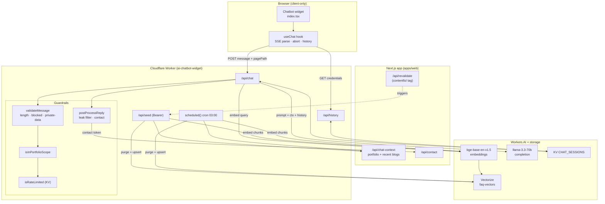

# Chatbot — Low-Level Design (LLD)

This document is the engineering-level design of the **Portfolio Assistant** chatbot: a
scoped, retrieval-augmented (RAG) assistant that answers questions about Dival Sehgal's
portfolio, experience, projects, skills, contact flow, and blog posts.

It complements the product-oriented [apps/web/CHAT_TECHNOLOGY.md](../apps/web/CHAT_TECHNOLOGY.md)
(the "what/why") with the implementation-level "how": module contracts, data shapes,
control flow, failure modes, and a maintenance plan.

- **Scope:** design + current behavior of the chat feature only.
- **Audience:** maintainers extending, debugging, or hardening the assistant.
- **Related:** [docs/hld-architecture.md](hld-architecture.md) for the wider platform.

---

## 1. Design goals & non-goals

| Goal | Why | Where enforced |
|---|---|---|
| Answer **only** portfolio/blog questions | Trust, brand safety, cost control | Scope gate + prompt (worker) |
| Ground every factual claim in indexed data | Prevent hallucinated employers/dates | Vectorize RAG + prompt rules |
| Never leak prompts, secrets, session data | Security | Input + output guardrails |
| Zero-backend-server operations cost | Runs on Cloudflare free-tier primitives | Worker AI + KV + Vectorize |
| No blocking of initial page render | LCP/perf | `dynamic(..., { ssr: false })` mount |

**Non-goals:** general-purpose chat, real-time streaming token-by-token from the model
(current impl streams a single completed answer over SSE), authenticated per-user
accounts, multi-language support.

---

## 2. Component inventory

| Layer | File | Responsibility |
|---|---|---|
| UI widget | [apps/web/src/components/Chatbot/index.tsx](../apps/web/src/components/Chatbot/index.tsx) | Toggle button, window, message list, input, suggestions |
| UI state | [apps/web/src/components/Chatbot/hooks/useChat.ts](../apps/web/src/components/Chatbot/hooks/useChat.ts) | History load, send, SSE parse, abort, clear |
| Mount | [apps/web/src/components/Providers/index.tsx](../apps/web/src/components/Providers/index.tsx) | Client-only dynamic import after mount |
| Context API | [apps/web/src/app/api/chat-context/route.ts](../apps/web/src/app/api/chat-context/route.ts) | Aggregates portfolio JSON + recent blogs for seeding |
| Worker entry | [apps/web/src/worker/index.ts](../apps/web/src/worker/index.ts) | `/api/chat`, `/api/history`, `/api/health`, cron |
| Seeding | [apps/web/src/worker/seed.ts](../apps/web/src/worker/seed.ts) | `/api/seed`, `runSeed`, CORS, vector purge/upsert |
| Types | [apps/web/src/worker/types.ts](../apps/web/src/worker/types.ts) | `Env`, `ChatSession`, `ChatMessage`, KV shape |
| Seed CLI | [apps/web/scripts/seed-chatbot.mjs](../apps/web/scripts/seed-chatbot.mjs) | Manual/CI reseed via authenticated call |
| Infra config | [apps/web/wrangler.json](../apps/web/wrangler.json) | AI/Vectorize/KV bindings, vars, cron |

### External bindings (Cloudflare)

| Binding | Type | Model / resource | Used for |
|---|---|---|---|
| `AI` | Workers AI | `@cf/baai/bge-base-en-v1.5` | Embeddings (query + seed) |
| `AI` | Workers AI | `@cf/meta/llama-3.3-70b-instruct-fp8-fast` | Answer generation |
| `VECTORIZE` | Vectorize | index `faq-vectors` | RAG chunk storage/retrieval |
| `CHAT_SESSIONS` | KV | — | Sessions (7d), rate counters, daily stats |

---

## 3. System diagram



---

## 4. Runtime data flow

### 4.1 Chat request (happy path)

1. **Widget → hook.** User submits text; `sendMessage` optimistically appends a `user`
   bubble, sets `isTyping`, and `POST`s `{ message, pagePath }` to
   `NEXT_PUBLIC_CHATBOT_URL/api/chat` with `credentials: 'include'`.
2. **Payload read.** Worker parses JSON, trims, rejects empty (`400`).
3. **Validation** ([`validateMessage`](../apps/web/src/worker/index.ts)): blocked-word list,
   private-data regex patterns, length ≤ 500. Failures return a guardrail SSE reply.
4. **Rate limit** ([`isRateLimited`](../apps/web/src/worker/index.ts)): `rate:<ip>:<bucket>`
   KV counter, max 20 / 60s window.
5. **Stats** (`trackRequest`): increments `stats:chat:<YYYY-MM-DD>`.
6. **Session load.** Read `chatbot_session` cookie → KV session (or mint a new one). Push
   the user message.
7. **Scope gate** ([`isInPortfolioScope`](../apps/web/src/worker/index.ts)): term match,
   greeting set, or follow-up terms when a recent portfolio conversation OR an active blog
   page exists. Out-of-scope → deterministic `OFF_TOPIC_REPLY`.
8. **Retrieval** (`faq`): embed `question (+ sanitized blog path)`, `VECTORIZE.query` topK=4,
   keep matches with `score ≥ 0.65`, join `metadata.text`.
9. **Prompt assembly.** `SYS` policy prompt + reference facts (labelled untrusted) + last 10
   session turns.
10. **Completion** (`runCompletion`): `llama-3.3-70b-instruct-fp8-fast`, `max_tokens=500`,
    `temperature=0.35`, `repetition_penalty=1.05`, `frequency_penalty=0.2`. Reads
    `response` or OpenAI-style `choices[0].message.content`.
11. **Post-process** (`postProcessReply`): strip `[SUBMIT_CONTACT: {...}]`, leak-pattern
    filter, validate + submit contact if present.
12. **Persist + respond.** Push assistant message, `KV.put` with 7d TTL, return SSE
    (`data: {response}` + `data: [DONE]`), setting the session cookie for new sessions.
13. **Client render.** `processStream` parses SSE, lazily creates the assistant bubble on
    the first token, replaces content as it accumulates.

### 4.2 Contact flow

The model, after collecting Name/Email/Message and user confirmation, emits
`[SUBMIT_CONTACT: {json}]`. The worker strips the token (never reaches browser),
`validateContact` (name ≤ 120, email regex ≤ 254, message ≤ 1000), then `POST`s to
`CONTACT_API_URL`. The user sees a deterministic success/failure line — **not** the model's
own claim of success.

### 4.3 Seeding / knowledge refresh

- **Trigger:** authenticated `POST /api/seed` (Bearer `SEED_SECRET`), the daily cron
  (`0 3 * * *`), the manual CLI, or Contentful revalidation.
- **`runSeed`:** fetch `CHAT_CONTEXT_URL` → build chunks (general, experience summary,
  per-experience, per-project, per-blog chunks of ≤1400 chars, contact) → embed in batches
  of 50 → `deleteManagedVectors` (purges stale + legacy IDs in batches of 100) →
  `VECTORIZE.upsert`.
- **Idempotent:** deterministic vector IDs mean re-seeding replaces rather than duplicates.

---

## 5. Key contracts

### 5.1 HTTP surface (Worker)

| Route | Method | Auth | Request | Response |
|---|---|---|---|---|
| `/api/chat` | POST | cookie (optional) | `{ message, pagePath? }` | SSE `text/event-stream` |
| `/api/history` | GET | cookie | — | `{ messages: ChatMessage[] }` |
| `/api/seed` | POST | Bearer `SEED_SECRET` | — | `{ success, count }` |
| `/api/health` | GET | none | — | `{ status: "ok" }` |

### 5.2 SSE contract

Every reply — guardrail or model — uses the **same** shape so the client has one code path:

```text
data: {"response":"<text>"}

data: [DONE]
```

### 5.3 Session (KV `CHAT_SESSIONS`)

| Key pattern | Value | TTL |
|---|---|---|
| `sess_<uuid>` | `ChatSession` JSON | 7 days |
| `rate:<ip>:<bucket>` | counter | 120s |
| `stats:chat:<date>` | daily counter | none |

---

## 6. What is right (strengths)

- **Defense in depth.** Independent input validation, scope gating, rate limiting, and
  output leak-filtering — the model failing does not automatically breach a boundary.
- **Grounded RAG.** Retrieved text is explicitly labelled untrusted and never used to
  *authorize* scope, mitigating a whole class of prompt-injection.
- **Deterministic contact + guardrails.** Success is reported only after the contact API
  returns OK; refusals/rate-limits are code-driven, not model-driven.
- **Idempotent seeding with stale purge.** Deterministic IDs + `deleteManagedVectors`
  (including legacy IDs) prevent orphaned vectors from starving retrieval.
- **Zero render cost.** `dynamic(ssr:false)` + mount-gated render keeps the widget out of
  the critical path and SSR HTML.
- **Resilient client stream parsing.** Buffered SSE split, lazy assistant bubble, request
  abort on new send/unmount, graceful error bubble.
- **Cost/perf conscious model config.** Low temperature + penalties balance variation vs.
  invention; batched embeddings respect Worker subrequest limits.
- **Operational automation.** Cron reseed + Contentful-tag reseed keep knowledge fresh with
  no manual step.

---

## 7. What is wrong / risks (current gaps)

Ordered by severity.

### High

1. **KV rate limiting is not atomic.** `get`→`+1`→`put` races under concurrency; a burst can
   exceed 20/min. KV is also eventually consistent. *(Acknowledged in CHAT_TECHNOLOGY.md.)*
2. **No edge WAF / bot protection.** `/api/chat` and `/api/seed` rely only on app-level
   checks. A determined caller can drive Workers AI cost.
3. **No automated guardrail tests for the worker.** `useChat` is tested, but there are no
   tests for prompt-injection, scope gating, leak filtering, seed auth, or contact
   validation — the most security-sensitive logic is unverified in CI.

### Medium

4. **"Streaming" is a single buffered completion.** The SSE contract implies streaming but
   the model call is non-streaming (a deliberate workaround for an empty-body runtime bug).
   TTFB equals full generation time; users wait with only a typing indicator.
5. **Scope gate is substring-based.** `portfolioTerms.some(includes)` yields false positives
   (e.g. "reactor", "contactless") and false negatives for legitimate rephrasings. Brittle
   and language-locked.
6. **Blocked-word list is naive.** Substring match on `['crypto', ...]` blocks
   "cryptography" and is trivially bypassed with spacing/synonyms.
7. **7-day PII retention.** Sessions store raw user messages (potentially names/emails from
   the contact flow) for 7 days in KV; review against the privacy notice.
8. **`pagePath` trust boundary.** Only `/blogs/<slug>` is honored, but the slug is still
   attacker-controlled and flows into the embedding query text.

### Low

9. **Similarity threshold (0.65) is a magic constant** with no tuning telemetry; retrieval
   misses are silent.
10. **No observability on quality.** Inference errors are `console.error` only; no metrics on
    retrieval hit-rate, refusals, or contact failures.
11. **Widget is not virtualized / not persisted client-side.** Long conversations re-render
    the full list; history depends on the worker round-trip.
12. **Duplicated env/URL defaults** (worker URL, site URL) hard-coded in several files; drift
    risk on rename.
13. **No message-level accessibility for streaming updates beyond `aria-live`;** rapid
    content replacement can spam screen readers.

---

## 8. What can be done more (roadmap)

### Security & abuse

- Add **Cloudflare Rate Limiting / WAF / Turnstile** in front of `/api/chat` and
  `/api/seed`; keep KV counter as a secondary fallback.
- Replace KV rate limiting with a **Durable Object** (or Rate Limiting API) for atomic,
  strongly-consistent counters.
- Add a lightweight **abuse budget** (daily per-IP cap) distinct from burst limiting.

### Quality & correctness

- **True token streaming** once the runtime streaming path is reliable — flush tokens as
  they arrive for perceived latency.
- Replace substring scope/blocked lists with a **small classifier** (embedding similarity to
  an "in-scope" centroid, or a cheap intent model) and make thresholds config-driven.
- **Tune retrieval:** log `score` distributions, evaluate topK/threshold, consider reranking.
- **Citations:** surface the source blog/slug for blog answers to build trust.

### Testing & observability

- Worker test suite: prompt-injection corpus, off-topic, blog follow-up, missing-context
  fallback, seed auth (401), stale-vector purge, contact success/failure/invalid.
- Structured logging + metrics (Workers Analytics Engine): retrieval hit-rate, refusals,
  rate-limit events, inference/contact failures — **without** logging raw messages.
- Golden-answer regression tests against a frozen seed snapshot.

### UX

- Client-side session persistence (e.g. `sessionStorage`) for instant reopen.
- Message virtualization for long threads.
- Stop/retry controls; markdown rendering for answers.

### Data & privacy

- Shorten session TTL (e.g. 24h) or store only non-PII turns; document retention.
- Add a "clear my data" path that deletes the KV session server-side.

---

## 9. How to maintain it (long-run playbook)

### 9.1 Configuration matrix

| Variable | Where | Purpose |
|---|---|---|
| `NEXT_PUBLIC_CHATBOT_URL` | Next.js | Worker base URL used by the client |
| `CHATBOT_SEED_SECRET` | Next.js | Bearer for revalidation-triggered reseed |
| `REVALIDATION_SECRET` | Next.js | Contentful webhook auth |
| `SEED_SECRET` | Worker secret | Auth for `/api/seed` (must match above) |
| `CHAT_CONTEXT_URL` | Worker var | Source of truth for seeding |
| `CONTACT_API_URL` | Worker var | Contact forwarding target |

Keep `CHATBOT_SEED_SECRET` (Next.js) and `SEED_SECRET` (Worker) **in sync** — a mismatch
silently breaks auto-reseed with a 401.

### 9.2 Routine operations

- **Deploy worker:** `yarn workspace web wrangler deploy`.
- **Manual reseed:** `yarn workspace web seed` (uses [seed-chatbot.mjs](../apps/web/scripts/seed-chatbot.mjs)).
- **Tail logs:** `yarn workspace web worker:tail`.
- **Health check:** `GET /api/health` → `{ status: "ok" }`.
- **Verify cron:** confirm the daily `0 3 * * *` reseed in Cloudflare observability.

### 9.3 When you change... do this

| Change | Required follow-up |
|---|---|
| Portfolio JSON / blog schema | Update `Portfolio`/`Blog` interfaces in [seed.ts](../apps/web/src/worker/seed.ts); reseed |
| Chunk IDs / seeding scheme | Extend `getManagedVectorIds` so old IDs are purged |
| Model name | Update `runCompletion` + note deprecation date; smoke-test output shape (`response` vs `choices`) |
| Embedding model | **Re-seed the entire index** (vector dimensions must match) |
| Prompt (`SYS`) | Re-run guardrail/regression tests; watch for scope drift |
| Allowed origins | Update `configuredOrigins` in [seed.ts](../apps/web/src/worker/seed.ts) `getCorsHeaders` |
| Scope/blocked lists | Add tests for new terms; beware substring false-positives |

### 9.4 Health signals to watch

- Rising `OFF_TOPIC_REPLY` / `FALLBACK_REPLY` rate → scope gate or retrieval regressed.
- Empty completions (`runCompletion` returns `''`) → model deprecation or output-shape drift.
- Seed `count` dropping unexpectedly → context API or Contentful fetch broken.
- Contact failures → downstream `/api/contact` issue.

### 9.5 Runbook — common failures

| Symptom | Likely cause | Action |
|---|---|---|
| Every answer is the fallback line | Empty/failed retrieval or empty completion | Check reseed `count`, model name, `VECTORIZE` binding |
| Auto-reseed stopped | Secret mismatch | Re-sync `SEED_SECRET` / `CHATBOT_SEED_SECRET` |
| CORS errors in browser | Origin not allowlisted | Add origin to `configuredOrigins` |
| History not loading | Cookie blocked cross-site | Verify `SameSite=None; Secure` in prod (HTTPS) |
| `#options` / undefined `this` error | `env.AI.run` detached | Keep the `env.AI.run.bind(env.AI)` pattern |
| Cost spike | Abuse / no edge limit | Enable Cloudflare Rate Limiting + Turnstile |

### 9.6 Dependencies & deprecation hygiene

- Track [Workers AI model deprecations](https://developers.cloudflare.com/changelog/post/2026-05-08-planned-model-deprecations/);
  the current Llama 3.3 fast variant replaced a deprecated 3-8B model.
- Pin `compatibility_date` deliberately (currently `2025-12-23`) and review on upgrades.
- Re-embed whenever the embedding model changes — dimensions must match the index.

---

## 10. Open questions

- Should conversation history be **client-owned** (privacy) rather than KV-owned (UX)?
- Is a per-user account model ever needed, or does anonymous-session suffice long-term?
- Should retrieval move to **hybrid search** (keyword + vector) for exact-name queries?
- What is the acceptable monthly Workers AI budget, and what caps enforce it?

---

*Last reviewed: 2026-08-08. Keep this file in sync with
[apps/web/CHAT_TECHNOLOGY.md](../apps/web/CHAT_TECHNOLOGY.md) when behavior changes.*
