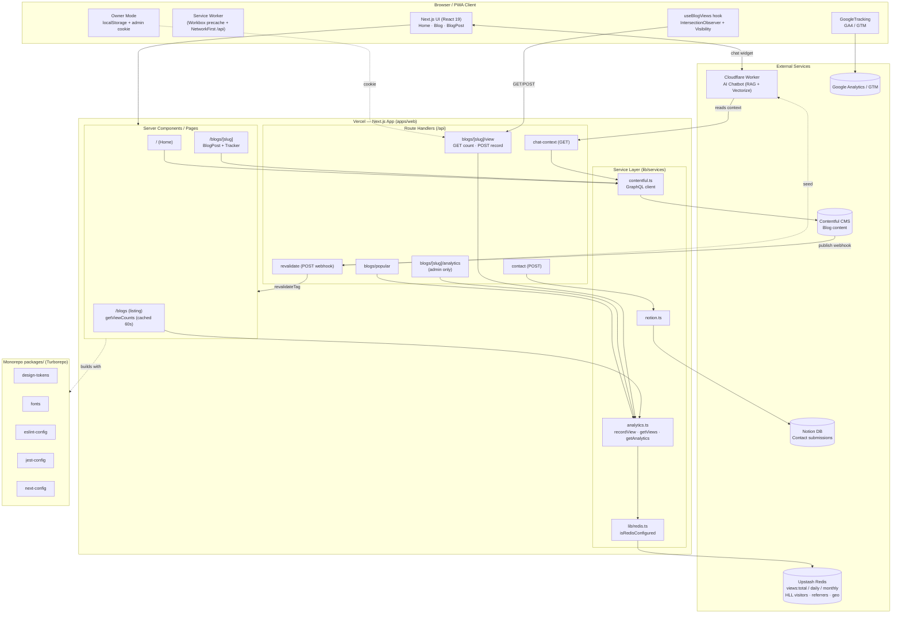

# High-Level Design (HLD)

This document describes the high-level architecture of the portfolio + blog platform
(a Turborepo monorepo with a Next.js 16 / React 19 app at `apps/web`).

## System diagram

> Rendered image: [diagrams/hld.svg](diagrams/hld.svg) · [diagrams/hld.png](diagrams/hld.png) · source: [diagrams/hld.mmd](diagrams/hld.mmd)

## Components

| Layer | Responsibility |
| --- | --- |
| **Client / PWA** | React 19 UI, service worker caching, view tracking, owner-mode opt-out, GA/GTM. |
| **Pages (RSC)** | Server-render blog listing/post/home; fetch content + cached view counts. |
| **Route Handlers** | `/api/*` endpoints (see endpoint audit below). |
| **Service layer** | Encapsulates Contentful (GraphQL), Notion, and Upstash Redis analytics. |
| **External** | Contentful CMS, Upstash Redis, Notion, Cloudflare Worker (AI chatbot), Google. |
| **packages/** | Shared design tokens, fonts, ESLint/Jest/Next configs built via Turborepo. |

## Blog view-count data flow

1. `BlogViewTracker` mounts on a post and calls `useBlogViews(slug)`.
2. **GET** `/api/blogs/[slug]/view` returns the current `views:total:<slug>` count.
3. After the reader is actively visible for 5s, the hook **POST**s the same route.
4. `recordView()` sets a 24h dedup key (`view:dedup:<slug>:<hash>`) with `SET NX EX`.
   On first set it atomically increments `views:total`, `views:daily`, `views:monthly`,
   adds the visitor to a HyperLogLog, and records referrer + country.
5. Owner mode (localStorage flag + `admin_view_secret` cookie) skips recording.
6. The listing page reads all counts in one pipeline via `getViewCounts`, cached 60s.

> **If counts do not increase:** the most common cause is missing
> `UPSTASH_REDIS_REST_URL` / `UPSTASH_REDIS_REST_TOKEN` (see `lib/redis.ts`,
> which now logs a warning and returns `recorded: false`), or owner mode being
> active in the current browser (`localStorage.removeItem('owner_mode')`).
